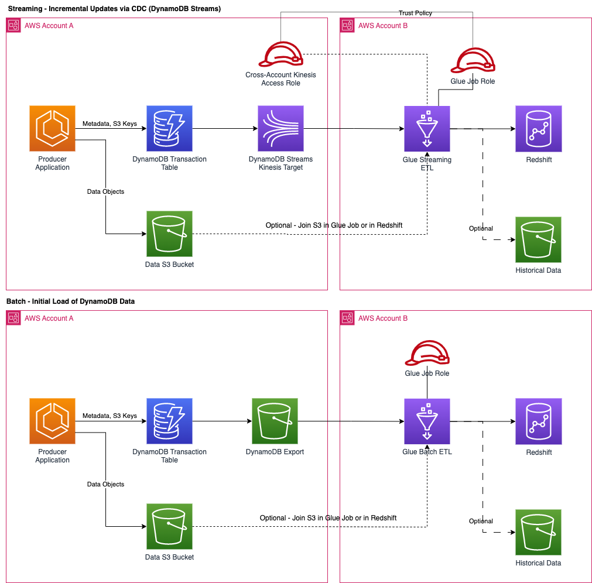

# DynamoDB Kinesis Streams Near-Real-Time Ingestion into Redshift with AWS Glue

This repository includes example code for writing real-time CDC data from DynamoDB into Redshift or S3
using AWS Glue and Kinesis Streams.

## Streaming
The `ddb_to_redshift.py` and `ddb_to_redshift_s3_join.py` files include the scripts necessary to write the CDC data into Redshift, with Redshift data using UPSERT behavior to preserve only the latest records. It stores the DynamoDB records as `SUPER` datatype, which allows subsequent transformation to be done with views in Redshift (Extract, Load, Transform).

The following configuration options are required, and passed as parameters to the Glue job as job arguments 
(e.g. `--StreamARN`):

 * `StreamARN` - The ARN of the Kinesis stream containing the DynamoDB data
 * `RedshiftConnectionName` - The connection in AWS glue to use to access Redshift - note that if your cluster must have enhanced VPC routing available, and connectivity to the Redshift and Glue service endpoints
 * `S3OutputPath` - The S3 path to write to for the S3 OutputMode
 * `RedshiftTableName` - The name of the table to write to in Redshift
 * `RedshiftStagingTableName` - The name of the staging table to use in Redshift when upserting data
 * `RedshiftSchema` - The schema name to use in Redshift containing the tables
 * `KinesisRoleARN` - The role ARN to use to access the Kinesis stream when using cross-account access, should be empty string when not using cross-account roles
 * `S3JoinPath` - The path to the data in S3 to join to, if joining in Glue
 * `RedshiftIAMRole` - Optional, the IAM role for Redshift to use

Note that when running in a private subnet / VPC without internet access, the following endpoints must be accessible:

* `glue.{region}.amazonaws.com`
* `redshift.{region}.amazonaws.com`
* `sts.{region}.amazonaws.com`

## Batch
The `ddb_to_redshift_batch.py` and `ddb_to_redshift_batch_s3_join.py` files include the scripts necessary to write the CDC data into Redshift, with Redshift data using UPSERT behavior to preserve only the latest records. It stores the DynamoDB records as `SUPER` datatype, which allows subsequent transformation to be done with views in Redshift (Extract, Load, Transform).

The following configuration options are required, and passed as parameters to the Glue job as job arguments 
(e.g. `--StreamARN`):

* `S3DynamoDbExportPath` - The path to the data exported from DynamoDB (e.g. `s3://{Bucket Name}/AWSDynamoDB/{Unique Export ID}/`)
 * `DynamoDbTableName` - The name of the DynamoDB table the export was generated from
 * `DynamoDbTableKeys` - A comma-separated list of the DynamoDB keys for the table, in the order specified in DynamoDB (order matters!)
 * `RedshiftConnectionName` - The connection in AWS glue to use to access Redshift - note that if your cluster must have enhanced VPC routing available, and connectivity to the Redshift and Glue service endpoints
 * `S3OutputPath` - The S3 path to write to for the S3 OutputMode
 * `RedshiftTableName` - The name of the table to write to in Redshift
 * `RedshiftStagingTableName` - The name of the staging table to use in Redshift when upserting data
 * `RedshiftSchema` - The schema name to use in Redshift containing the tables
 * `S3JoinPath` - The path to the data in S3 to join to, if joining in Glue
 * `RedshiftIAMRole` - Optional, the IAM role for Redshift to use

Note that when running in a private subnet / VPC without internet access, the following endpoints must be accessible:

* `glue.{region}.amazonaws.com`
* `redshift.{region}.amazonaws.com`
* `sts.{region}.amazonaws.com`

